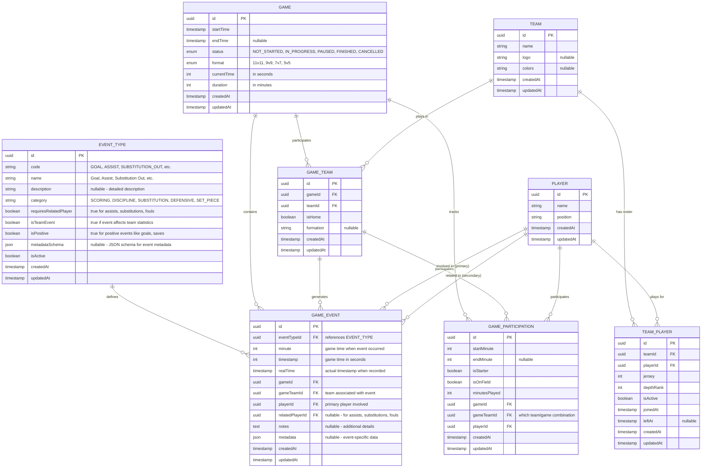

# Soccer Stats API - Event-Based ER Diagram

This document contains the event-based ER diagram for the Soccer Stats API entities, using a unified event system for all game activities.

## Event-Based ER Diagram



## Entity Descriptions

### EventType (Reference Data)

Defines all possible event types that can occur during a game. This provides:

**Key Features:**

- **Data Integrity**: Foreign key constraint ensures only valid event types
- **Extensibility**: Add new event types without code changes
- **Metadata Validation**: JSON schema for event-specific data validation
- **Categorization**: Events grouped by category for reporting and filtering
- **Business Rules**: Flags indicate event behavior (requires related player, team impact, etc.)

**Sample Event Types:**

| Code               | Name             | Category     | Requires Related Player | Is Team Event | Is Positive |
| ------------------ | ---------------- | ------------ | ----------------------- | ------------- | ----------- |
| `GOAL`             | Goal             | SCORING      | false                   | true          | true        |
| `ASSIST`           | Assist           | SCORING      | true                    | true          | true        |
| `SUBSTITUTION_OUT` | Substitution Out | SUBSTITUTION | true                    | true          | false       |
| `SUBSTITUTION_IN`  | Substitution In  | SUBSTITUTION | true                    | true          | true        |
| `YELLOW_CARD`      | Yellow Card      | DISCIPLINE   | false                   | false         | false       |
| `RED_CARD`         | Red Card         | DISCIPLINE   | false                   | false         | false       |
| `FOUL`             | Foul             | DISCIPLINE   | true                    | false         | false       |
| `SAVE`             | Save             | DEFENSIVE    | true                    | true          | true        |
| `CORNER`           | Corner Kick      | SET_PIECE    | false                   | true          | true        |
| `PENALTY`          | Penalty          | SET_PIECE    | false                   | true          | true        |
| `OFFSIDE`          | Offside          | DISCIPLINE   | false                   | false         | false       |

**Key Relationships:**

- One-to-many with GameEvent

### Game Event (Unified Event System)

- `playerId`: The goal scorer
- `relatedPlayerId`: The assist provider (nullable)
- `metadata`: `{"goalType": "header|shot|penalty|own_goal", "bodyPart": "left_foot|right_foot|head|chest"}`

#### **ASSIST**

- `playerId`: The assist provider
- `relatedPlayerId`: The goal scorer
- `metadata`: `{"assistType": "pass|cross|through_ball|set_piece"}`

#### **SUBSTITUTION_OUT / SUBSTITUTION_IN**

- Two separate events for better tracking
- `SUBSTITUTION_OUT`: `playerId` = player leaving, `relatedPlayerId` = player coming in
- `SUBSTITUTION_IN`: `playerId` = player coming in, `relatedPlayerId` = player leaving
- `metadata`: `{"reason": "tactical|injury|fatigue|disciplinary|other"}`

#### **YELLOW_CARD / RED_CARD**

- `playerId`: Player receiving the card
- `metadata`: `{"reason": "foul|dissent|unsporting_behavior|delaying_game|simulation"}`

#### **FOUL**

- `playerId`: Player committing the foul
- `relatedPlayerId`: Player fouled (nullable)
- `metadata`: `{"foulType": "minor|major|professional", "location": "penalty_area|midfield|defensive_third"}`

#### **SAVE**

- `playerId`: Goalkeeper making the save
- `relatedPlayerId`: Player who shot (nullable)
- `metadata`: `{"saveType": "catch|parry|tip_over|block", "shotType": "header|shot|free_kick"}`

#### **CORNER / FREE_KICK / PENALTY**

- `playerId`: Player taking the set piece
- `metadata`: `{"location": "left|right|center", "outcome": "goal|shot|cleared|wasted"}`

#### **OFFSIDE**

- `playerId`: Player caught offside
- `metadata`: `{"severity": "minor|clear|disputed"}`

## Entity Descriptions

### GameEvent (Central Event System)

The core entity that captures all significant events during a game. This unified approach provides:

**Advantages:**

- **Extensibility**: Easy to add new event types without schema changes
- **Consistency**: All events have the same core structure (time, players, teams)
- **Flexibility**: `metadata` JSON field allows event-specific data
- **Queryability**: Simple to get all events for a game/player/team
- **Analytics**: Easy to build statistics and reports from unified data

**Key Relationships:**

- Many-to-one with Game
- Many-to-one with GameTeam
- Many-to-one with Player (primary)
- Many-to-one with Player (related/secondary)

### Event Queries Examples

```sql
-- Get all goals in a game
SELECT * FROM game_events
WHERE gameId = ? AND eventType = 'GOAL'
ORDER BY minute;

-- Get all events for a specific player
SELECT * FROM game_events
WHERE playerId = ? OR relatedPlayerId = ?
ORDER BY realTime;

-- Get yellow/red cards in a game
SELECT * FROM game_events
WHERE gameId = ? AND eventType IN ('YELLOW_CARD', 'RED_CARD')
ORDER BY minute;

-- Get assists and goals together for statistics
SELECT * FROM game_events
WHERE eventType IN ('GOAL', 'ASSIST')
ORDER BY minute;
```

## Benefits of Event-Based Design

### 1. **Unified Data Model**

- Single table for all game events
- Consistent timing and player tracking
- Simplified relationships

### 2. **Easy Extensions**

- Add new event types without changing schema
- Event-specific data in `metadata` JSON field
- No need for new tables for each event type

### 3. **Better Analytics**

- Single source of truth for all game events
- Easy to build comprehensive statistics
- Timeline reconstruction from unified events

### 4. **Flexible Relationships**

- Primary and related players for complex events
- Team context for all events
- Hierarchical event organization

### 5. **Performance Benefits**

- Single table queries for event timelines
- Indexed by game, team, player, and time
- Reduced JOIN complexity

### 6. **Real-time Features**

- Live event feeds from single table
- Easy event streaming and notifications
- Simplified caching strategies

## Migration from Current Design

The event-based approach would replace:

- ✅ `Goal` entity → `GAME_EVENT` with `eventType: 'GOAL'`
- ✅ `Substitution` entity → `GAME_EVENT` with `eventType: 'SUBSTITUTION_OUT/IN'`
- ✅ New capabilities for cards, fouls, saves, etc.

This provides a much more scalable and maintainable architecture for tracking all soccer game events.
