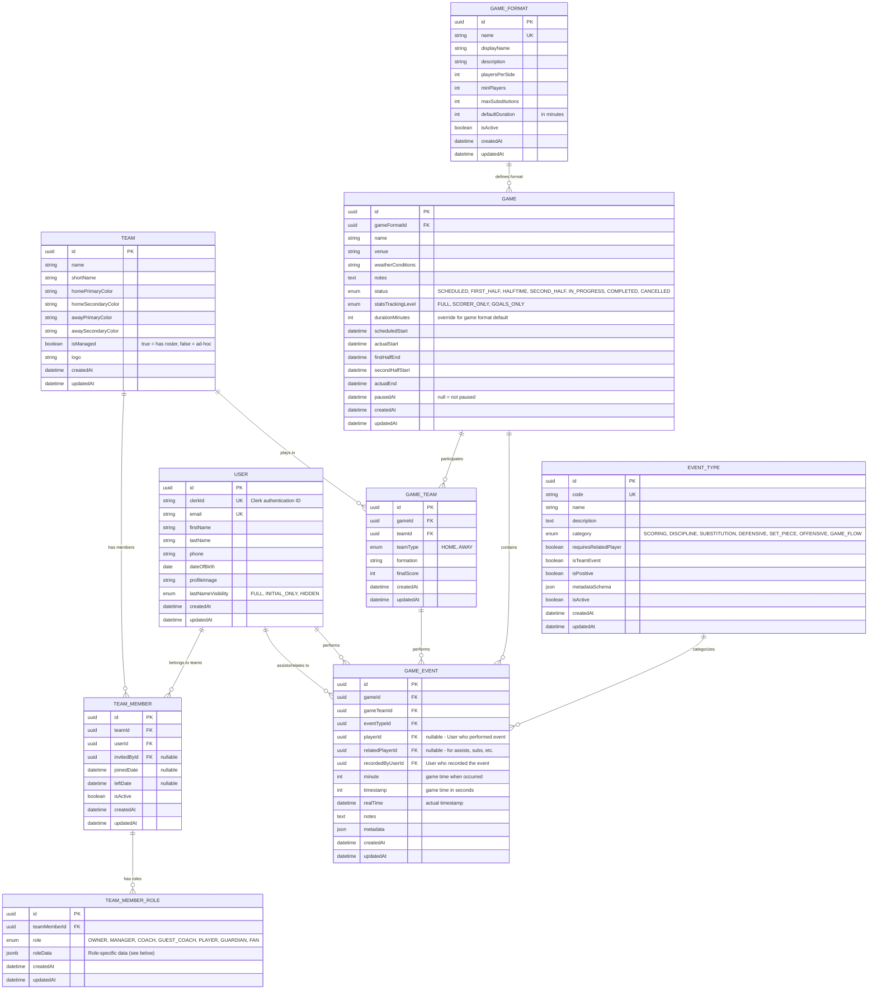

# Soccer Stats API - Entity Relationship Diagram

This document contains the ER diagram for the Soccer Stats API entities, showing the relationships between all database tables.

## ER Diagram

### Current Schema (Team Membership Model)



## TeamMemberRole - roleData Schema

The `roleData` JSONB column stores role-specific information. Here are the schemas for each role:

### PLAYER Role

```json
{
  "jerseyNumber": "10",
  "primaryPosition": "Midfielder"
}
```

### COACH / GUEST_COACH Role

```json
{
  "title": "Head Coach"
}
```

### GUARDIAN Role

```json
{
  "linkedPlayerId": "uuid-of-player-they-guard"
}
```

### OWNER / MANAGER / FAN Roles

```json
{}
```

No additional data required.

## Entity Descriptions

### User

Represents a person in the system. Users can have multiple team memberships with different roles. Authentication is handled via Clerk (external auth provider).

**Key Relationships:**

- One-to-many with TeamMember (memberships across teams)
- One-to-many with GameEvent (as performer and related player)

### Team

Represents a soccer team. Can be "managed" (with a maintained roster) or "unmanaged" (ad-hoc teams for pickup games).

**Key Relationships:**

- One-to-many with TeamMember (team roster/staff)
- Many-to-many with Games (through GameTeam junction)

### TeamMember

Junction entity linking Users to Teams. Represents a person's membership in a team, regardless of their specific role(s).

**Key Relationships:**

- Many-to-one with User
- Many-to-one with Team
- One-to-many with TeamMemberRole (roles within the team)

**Design Note:** A user can only have ONE TeamMember record per team, but can have multiple roles via TeamMemberRole.

### TeamMemberRole

Stores the specific roles a team member holds. A member can have multiple roles (e.g., PLAYER + COACH for a playing coach).

**Key Features:**

- `role` enum defines the role type
- `roleData` JSONB stores role-specific data (jersey number, position, coach title, etc.)
- Unique constraint on (teamMemberId, role) - can't have duplicate roles

**Role Types:**

- `OWNER` - Team owner with full administrative rights
- `MANAGER` - Team manager with roster management rights
- `COACH` - Team coach
- `GUEST_COACH` - Guest/visiting coach
- `PLAYER` - Active player on the roster
- `GUARDIAN` - Parent/guardian of a minor player
- `FAN` - Supporter with view-only access

### Game

Represents a soccer match with timing, status, and scoring information.

**Key Relationships:**

- Many-to-one with GameFormat
- One-to-many with GameTeam (participating teams)
- One-to-many with GameEvent (events during the game)

### GameTeam

Junction table linking Games to Teams with game-specific information.

**Key Relationships:**

- Many-to-one with Game
- Many-to-one with Team
- One-to-many with GameEvent

### EventType

Defines types of events that can occur during a game (goals, fouls, substitutions, etc.).

### GameEvent

Records individual events during a game using a unified, flexible event system.

**Key Features:**

- Links to EventType for categorization
- Tracks both game time and real time
- Supports related players (assists, substitution pairs)
- Flexible metadata for event-specific data

## Key Design Decisions

### Unified Team Membership Model

The `TeamMember` + `TeamMemberRole` model replaces the previous separate `TeamPlayer` and `TeamCoach` entities:

**Benefits:**

1. **Single source of truth** - One membership record per user per team
2. **Multi-role support** - A person can be both PLAYER and COACH
3. **Extensible** - Easy to add new roles (GUARDIAN, FAN) without schema changes
4. **Consistent queries** - All team membership queries go through TeamMember

**Migration Path:**

- `team_players` data → `TeamMember` + `TeamMemberRole(PLAYER)`
- `team_coaches` data → `TeamMember` + `TeamMemberRole(COACH)`
- `isGuest` flag → separate `GUEST_COACH` role
- `linkedPlayerId` → moved to roleData for GUARDIAN role

### JSONB roleData

Role-specific data is stored in a JSONB column rather than nullable columns:

**Benefits:**

1. **Schema flexibility** - Add new fields without migrations
2. **Clean entity** - TeamMemberRole stays lean
3. **Type safety** - Computed getters provide typed access

**Access Pattern:**

```typescript
// In TeamMemberRole entity
@Field(() => String, { nullable: true })
get jerseyNumber(): string | undefined {
  return this.roleData?.jerseyNumber;
}
```

## Database Indexes

Key indexes for performance:

```sql
-- TeamMember uniqueness
CREATE UNIQUE INDEX idx_team_member_unique ON team_members (teamId, userId);

-- TeamMemberRole uniqueness (one role per type per membership)
CREATE UNIQUE INDEX idx_team_member_role_unique ON team_member_roles (teamMemberId, role);

-- Fast lookups
CREATE INDEX idx_team_member_team ON team_members (teamId);
CREATE INDEX idx_team_member_user ON team_members (userId);
CREATE INDEX idx_team_member_role_member ON team_member_roles (teamMemberId);
```
