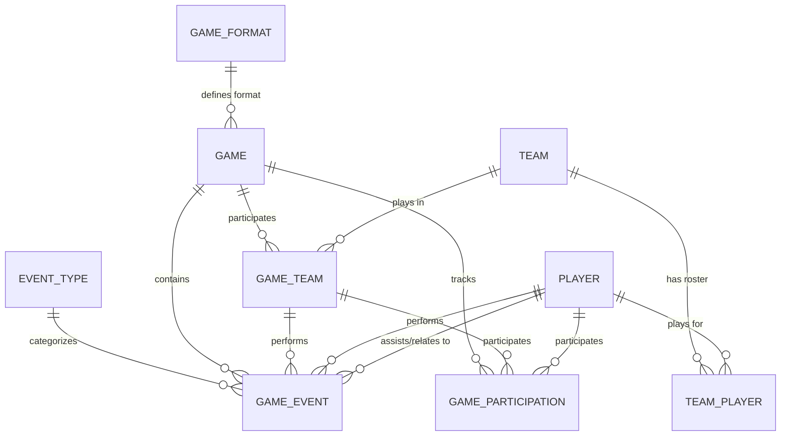
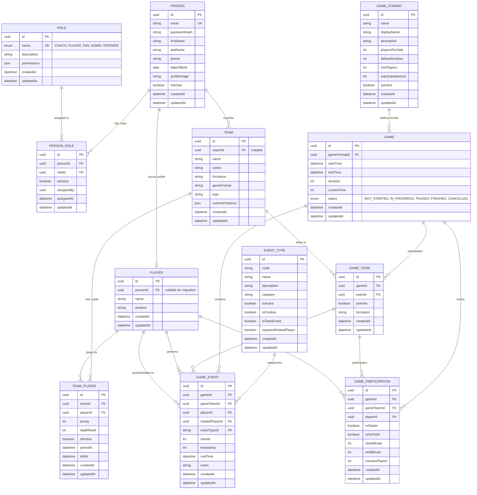

# Soccer Stats API - Entity Relationship Diagram

This document contains the ER diagram for the Soccer Stats API entities, showing the relationships between all database tables.

## ER Diagram

### Simplified View (Entities and Relationships Only)

````mermaid
erDiagram
    GAME_FORMAT ||--o{ GAME : "defines format"
    GAME ||--o{ GAME_TEAM : "participates"
    TEAM ||--o{ GAME_TEAM : "plays in"
    TEAM ||--o{ TEAM_PLAYER : "has roster"
    PLAYER ||--o{ TEAM_PLAYER : "plays for"

    EVENT_TYPE ||--o{ GAME_EVENT : "categorizes"
    GAME ||--o{ GAME_EVENT : "contains"
    GAME ||--o{ GAME_PARTICIPATION : "tracks"

    GAME_TEAM ||--o{ GAME_EVENT : "performs"
    GAME_TEAM ||--o{ GAME_PARTICIPATION : "participates"

    PLAYER ||--o{ GAME_EVENT : "performs"
    PLAYER ||--o{ GAME_EVENT : "assists/relates to"
    PLAYER ||--o{ GAME_PARTICIPATION : "participates"




```


```mermaid if (!teamId) {
    navigate('/teams');
    return null;
  }
erDiagram
    %% User Management Entities
    PERSON ||--o{ PERSON_ROLE : "has roles"
    ROLE ||--o{ PERSON_ROLE : "assigned to"
    PERSON ||--o| PLAYER : "soccer profile"
    PERSON ||--o{ TEAM : "coaches"

    %% Existing Soccer Domain Entities
    GAME_FORMAT ||--o{ GAME : "defines format"
    GAME ||--o{ GAME_TEAM : "participates"
    TEAM ||--o{ GAME_TEAM : "plays in"
    TEAM ||--o{ TEAM_PLAYER : "has roster"
    PLAYER ||--o{ TEAM_PLAYER : "plays for"

    EVENT_TYPE ||--o{ GAME_EVENT : "categorizes"
    GAME ||--o{ GAME_EVENT : "contains"
    GAME ||--o{ GAME_PARTICIPATION : "tracks"

    GAME_TEAM ||--o{ GAME_EVENT : "performs"
    GAME_TEAM ||--o{ GAME_PARTICIPATION : "participates"

    PLAYER ||--o{ GAME_EVENT : "performs"
    PLAYER ||--o{ GAME_EVENT : "assists/relates to"
    PLAYER ||--o{ GAME_PARTICIPATION : "participates"

    %% Entity Definitions
    PERSON {
        uuid id PK
        string email UK
        string passwordHash
        string firstName
        string lastName
        string phone
        date dateOfBirth
        string profileImage
        boolean isActive
        datetime createdAt
        datetime updatedAt
    }

    ROLE {
        uuid id PK
        enum name UK "COACH, PLAYER, FAN, ADMIN, REFEREE"
        string description
        json permissions
        datetime createdAt
        datetime updatedAt
    }

    PERSON_ROLE {
        uuid id PK
        uuid personId FK
        uuid roleId FK
        boolean isActive
        uuid assignedBy
        datetime assignedAt
        datetime updatedAt
    }

    PLAYER {
        uuid id PK
        uuid personId FK "nullable for migration"
        string name
        string position
        datetime createdAt
        datetime updatedAt
    }

    TEAM {
        uuid id PK
        uuid coachId FK "nullable"
        string name
        string colors
        string formation
        string gameFormat
        string logo
        json customPositions
        datetime createdAt
        datetime updatedAt
    }

    GAME_FORMAT {
        uuid id PK
        string name
        string displayName
        string description
        int playersPerSide
        int defaultDuration
        int minPlayers
        int maxSubstitutions
        boolean isActive
        datetime createdAt
        datetime updatedAt
    }

    GAME {
        uuid id PK
        uuid gameFormatId FK
        datetime startTime
        datetime endTime
        int duration
        int currentTime
        enum status "NOT_STARTED, IN_PROGRESS, PAUSED, FINISHED, CANCELLED"
        datetime createdAt
        datetime updatedAt
    }

    GAME_TEAM {
        uuid id PK
        uuid gameId FK
        uuid teamId FK
        boolean isHome
        string formation
        datetime createdAt
        datetime updatedAt
    }

    TEAM_PLAYER {
        uuid id PK
        uuid teamId FK
        uuid playerId FK
        int jersey
        int depthRank
        boolean isActive
        datetime joinedAt
        datetime leftAt
        datetime createdAt
        datetime updatedAt
    }

    EVENT_TYPE {
        uuid id PK
        string code
        string name
        string description
        string category
        boolean isActive
        boolean isPositive
        boolean isTeamEvent
        boolean requiresRelatedPlayer
        datetime createdAt
        datetime updatedAt
    }

    GAME_EVENT {
        uuid id PK
        uuid gameId FK
        uuid gameTeamId FK
        uuid playerId FK
        uuid relatedPlayerId FK
        string eventTypeId FK
        int minute
        int timestamp
        datetime realTime
        string notes
        datetime createdAt
        datetime updatedAt
    }

    GAME_PARTICIPATION {
        uuid id PK
        uuid gameId FK
        uuid gameTeamId FK
        uuid playerId FK
        boolean isStarter
        boolean isOnField
        int startMinute
        int endMinute
        int minutesPlayed
        datetime createdAt
        datetime updatedAt
    }
```



````

### Detailed View (With Entity Attributes)

<details>
<summary>Click to expand detailed entity structure</summary>

```mermaid
erDiagram
    GAME {
        uuid id PK
        timestamp startTime
        timestamp endTime "nullable"
        enum status "NOT_STARTED, IN_PROGRESS, PAUSED, FINISHED, CANCELLED"
        uuid gameFormatId FK
        int currentTime "in seconds"
        int duration "in minutes"
        timestamp createdAt
        timestamp updatedAt
    }

    GAME_FORMAT {
        uuid id PK
        string name "unique - e.g., 11v11, 9v9, 7v7, 5v5"
        string displayName "e.g., 11 vs 11"
        int playersPerSide
        int minPlayers "nullable"
        int maxSubstitutions "nullable"
        int defaultDuration "in minutes"
        boolean isActive
        text description "nullable"
        timestamp createdAt
        timestamp updatedAt
    }

    TEAM {
        uuid id PK
        string name
        string logo "nullable"
        string colors "nullable"
        string gameFormat "nullable"
        string formation "nullable"
        json customPositions "nullable"
        timestamp createdAt
        timestamp updatedAt
    }

    PLAYER {
        uuid id PK
        string name
        string position
        timestamp createdAt
        timestamp updatedAt
    }

    GAME_TEAM {
        uuid id PK
        uuid gameId FK
        uuid teamId FK
        boolean isHome
        string formation "nullable"
        timestamp createdAt
        timestamp updatedAt
    }

    TEAM_PLAYER {
        uuid id PK
        uuid teamId FK
        uuid playerId FK
        int jersey
        int depthRank
        boolean isActive
        timestamp joinedAt
        timestamp leftAt "nullable"
        timestamp createdAt
        timestamp updatedAt
    }

    EVENT_TYPE {
        uuid id PK
        string code "unique"
        string name
        text description "nullable"
        enum category "SCORING, DISCIPLINE, SUBSTITUTION, DEFENSIVE, SET_PIECE, OFFENSIVE, GAME_FLOW"
        boolean requiresRelatedPlayer
        boolean isTeamEvent
        boolean isPositive
        json metadataSchema "nullable"
        boolean isActive
        timestamp createdAt
        timestamp updatedAt
    }

    GAME_EVENT {
        uuid id PK
        int minute "game time when occurred"
        int timestamp "game time in seconds"
        timestamp realTime "actual timestamp"
        text notes "nullable"
        json metadata "nullable"
        uuid eventTypeId FK
        uuid gameId FK
        uuid gameTeamId FK
        uuid playerId FK
        uuid relatedPlayerId FK "nullable"
        timestamp createdAt
        timestamp updatedAt
    }

    GAME_PARTICIPATION {
        uuid id PK
        int startMinute
        int endMinute "nullable"
        boolean isStarter
        boolean isOnField
        int minutesPlayed
        uuid gameId FK
        uuid gameTeamId FK "which team/game combination"
        uuid playerId FK
        timestamp createdAt
        timestamp updatedAt
    }

    %% Relationships
    GAME_FORMAT ||--o{ GAME : "defines format"
    GAME ||--o{ GAME_TEAM : "participates"
    TEAM ||--o{ GAME_TEAM : "plays in"
    TEAM ||--o{ TEAM_PLAYER : "has roster"
    PLAYER ||--o{ TEAM_PLAYER : "plays for"

    EVENT_TYPE ||--o{ GAME_EVENT : "categorizes"
    GAME ||--o{ GAME_EVENT : "contains"
    GAME ||--o{ GAME_PARTICIPATION : "tracks"

    GAME_TEAM ||--o{ GAME_EVENT : "performs"
    GAME_TEAM ||--o{ GAME_PARTICIPATION : "participates"

    PLAYER ||--o{ GAME_EVENT : "performs"
    PLAYER ||--o{ GAME_EVENT : "assists/relates to"
    PLAYER ||--o{ GAME_PARTICIPATION : "participates"
````

</details>

## Entity Descriptions

### Game

The main entity representing a soccer match. Contains game metadata, timing information, and status tracking. Now references a GameFormat entity instead of storing format as an enum.

**Key Relationships:**

- Many-to-one with GameFormat (defines the game format rules)
- Many-to-many with Teams (through GameTeam junction table)
- One-to-many with GameEvents (all events that occurred in the game)
- One-to-many with GameParticipations (player participation tracking)

### GameFormat

Represents different soccer game formats (11v11, 9v9, 7v7, 5v5) with their specific rules and configurations. This replaces the previous enum approach with a more flexible entity-based system.

**Key Relationships:**

- One-to-many with Games (games played in this format)

**Key Features:**

- Configurable players per side, minimum players, and substitution limits
- Default duration settings for each format
- Active/inactive status for format management
- Descriptive names and detailed descriptions

### Team

Represents a soccer team that can participate in multiple games. Contains team-specific information like name, logo, colors, and team-level configurations.

**Key Relationships:**

- Many-to-many with Games (through GameTeam junction table)
- Many-to-many with Players (through TeamPlayer junction table)

**Enhanced Features:**

- Team-specific game format preferences
- Default formation settings
- Custom position definitions (JSON field)

### Player

Represents individual players who can play for multiple teams throughout their career.

**Key Relationships:**

- Many-to-many with Teams (through TeamPlayer junction table)
- One-to-many with GameEvents (as primary player and related player)
- One-to-many with GameParticipations

### GameTeam (Junction Table)

Links Games and Teams, storing game-specific team information like home/away status and formation for that particular game.

**Key Relationships:**

- Many-to-one with Game
- Many-to-one with Team
- One-to-many with GameEvents (events performed by this team in this game)
- One-to-many with GameParticipations (player participations for this team in this game)

### TeamPlayer (Junction Table)

Links Teams and Players, storing team-specific player information like jersey number, depth rank, and roster dates.

**Key Relationships:**

- Many-to-one with Team
- Many-to-one with Player

### EventType

Defines the types of events that can occur during a game (goals, fouls, substitutions, etc.). This provides a flexible system for tracking any type of game event.

**Key Relationships:**

- One-to-many with GameEvents

**Key Features:**

- Event categorization (SCORING, DISCIPLINE, SUBSTITUTION, etc.)
- Configurable metadata requirements
- Support for events requiring related players (e.g., assists, substitutions)
- Positive/negative event classification
- Active/inactive status for event type management

### GameEvent

Records individual events that occur during a game, replacing the previous separate Goal and Substitution entities with a unified, flexible event system.

**Key Relationships:**

- Many-to-one with Game
- Many-to-one with EventType
- Many-to-one with GameTeam (which team the event relates to)
- Many-to-one with Player (primary player involved)
- Many-to-one with Player (related player - nullable, for assists, substitutions, etc.)

**Key Features:**

- Flexible metadata system for event-specific data
- Support for both minute and timestamp tracking
- Real-time timestamp recording
- Optional notes for additional context
- Support for related players (assists, substitution partners, etc.)

### GameParticipation

Junction table that tracks when and how long each player participated in a specific game for a specific team. Unchanged from the previous design.

**Key Relationships:**

- Many-to-one with Game
- Many-to-one with GameTeam (which team the player was representing)
- Many-to-one with Player

## Key Features

1. **Flexible Game Formats**: Game formats are now configurable entities rather than hardcoded enums
   - Supports different player counts (11v11, 9v9, 7v7, 5v5)
   - Configurable rules per format (minimum players, max substitutions, default duration)
   - Easy addition of new formats without code changes
2. **Unified Event System**: All game events (goals, fouls, substitutions, etc.) are handled through a single, flexible system
   - EventType entity defines available event categories
   - GameEvent entity records all occurrences with metadata
   - Supports complex events with related players (assists, substitution pairs)
3. **Real-time Tracking**: Tracks game time vs real time for accurate statistics
4. **Player Participation**: Detailed tracking of when players enter/exit games
5. **Flexible Event Metadata**: JSON-based metadata system for event-specific data
6. **Team Management**: Supports home/away team designation within game context
7. **Enhanced Team Configuration**:
   - Team-specific game format preferences
   - Custom position definitions
   - Default formation settings
8. **Many-to-Many Relationships**:
   - Teams can play in multiple games
   - Players can play for multiple teams
   - Proper junction tables handle complex relationships
9. **Historical Tracking**:
   - Track when players join/leave teams
   - Track team formations for specific games
   - Maintain player roster history
   - Complete event history with timestamps
10. **Event Classification**:
    - Events categorized by type (SCORING, DISCIPLINE, SUBSTITUTION, etc.)
    - Positive/negative event classification
    - Team vs individual event distinction

## Database Design Benefits

- **Normalization**: Eliminates data redundancy by separating concerns into focused entities
- **Flexibility**:
  - Teams and players can have complex, real-world relationships
  - Game formats are configurable without code changes
  - Event system can handle any type of game occurrence
- **Scalability**: Can easily add new teams, players, games, formats, and event types without schema changes
- **Extensibility**:
  - JSON metadata fields allow for future enhancements without migrations
  - Event type system supports unlimited event categories
  - Custom team positions support varying tactical approaches
- **Historical Data**: Maintains complete history of:
  - Player transfers and team changes
  - Game format evolution
  - All game events with full context
- **Game Context**: Each game can have specific formations, events, and player assignments
- **Event Richness**: Unified event system provides:
  - Detailed event categorization and classification
  - Support for complex multi-player events
  - Flexible metadata for event-specific information
  - Real-time and game-time correlation
- **Configuration Management**:
  - Game formats can be activated/deactivated
  - Event types can be managed dynamically
  - Team configurations are persistent and reusable
