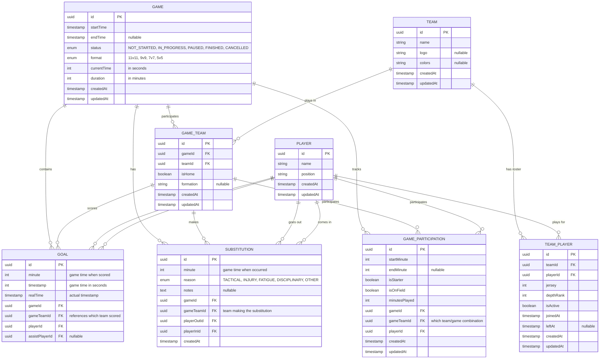

# Soccer Stats API - Entity Relationship Diagram

This document contains the ER diagram for the Soccer Stats API entities, showing the relationships between all database tables.

## ER Diagram

## Entity Descriptions

### Game

The main entity representing a soccer match. Contains game metadata, timing information, and status tracking. No longer stores team names directly.

**Key Relationships:**

- Many-to-many with Teams (through GameTeam junction table)
- One-to-many with Goals (all goals scored in the game)
- One-to-many with Substitutions (all player changes)
- One-to-many with GameParticipations (player participation tracking)

### Team

Represents a soccer team that can participate in multiple games. Contains team-specific information like name, logo, and colors.

**Key Relationships:**

- Many-to-many with Games (through GameTeam junction table)
- Many-to-many with Players (through TeamPlayer junction table)

### Player

Represents individual players who can play for multiple teams throughout their career.

**Key Relationships:**

- Many-to-many with Teams (through TeamPlayer junction table)
- One-to-many with Goals (as scorer and assist provider)
- One-to-many with Substitutions (as player going out or coming in)
- One-to-many with GameParticipations

### GameTeam (Junction Table)

Links Games and Teams, storing game-specific team information like home/away status and formation for that particular game.

**Key Relationships:**

- Many-to-one with Game
- Many-to-one with Team
- One-to-many with Goals (goals scored by this team in this game)
- One-to-many with Substitutions (substitutions made by this team in this game)
- One-to-many with GameParticipations (player participations for this team in this game)

### TeamPlayer (Junction Table)

Links Teams and Players, storing team-specific player information like jersey number, depth rank, and roster dates.

**Key Relationships:**

- Many-to-one with Team
- Many-to-one with Player

### Goal

Records individual goals scored during a game, now properly linked to the GameTeam that scored.

**Key Relationships:**

- Many-to-one with Game
- Many-to-one with GameTeam (which team scored in which game)
- Many-to-one with Player (scorer)
- Many-to-one with Player (assist - nullable)

### Substitution

Tracks player substitutions during a game, now properly linked to the GameTeam making the substitution.

**Key Relationships:**

- Many-to-one with Game
- Many-to-one with GameTeam (which team made the substitution)
- Many-to-one with Player (player going out)
- Many-to-one with Player (player coming in)

### GameParticipation

Junction table that tracks when and how long each player participated in a specific game for a specific team.

**Key Relationships:**

- Many-to-one with Game
- Many-to-one with GameTeam (which team the player was representing)
- Many-to-one with Player

## Key Features

1. **Flexible Game Formats**: Supports different game formats (11v11, 9v9, 7v7, 5v5)
2. **Real-time Tracking**: Tracks game time vs real time for accurate statistics
3. **Player Participation**: Detailed tracking of when players enter/exit games
4. **Goal Attribution**: Supports both scorer and assist tracking
5. **Substitution Management**: Tracks player changes with reasons
6. **Team Management**: Supports home/away team designation within game context
7. **Many-to-Many Relationships**:
   - Teams can play in multiple games
   - Players can play for multiple teams
   - Proper junction tables handle complex relationships
8. **Historical Tracking**:
   - Track when players join/leave teams
   - Track team formations for specific games
   - Maintain player roster history

## Database Design Benefits

- **Normalization**: Eliminates data redundancy by separating concerns
- **Flexibility**: Teams and players can have complex, real-world relationships
- **Scalability**: Can easily add new teams, players, and games without constraints
- **Historical Data**: Maintains complete history of player transfers and team changes
- **Game Context**: Each game can have specific formations and player assignments
