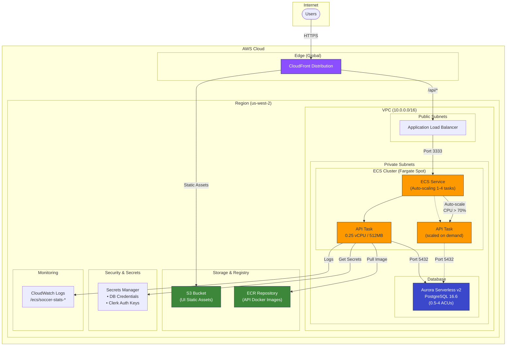

# Soccer Stats AWS Architecture

## Overview

The soccer-stats application runs on AWS using a serverless-first architecture optimized for cost efficiency during the beta phase.

## Architecture Diagram



## Component Details

### Edge Layer

| Component      | Purpose       | Configuration                                                   |
| -------------- | ------------- | --------------------------------------------------------------- |
| **CloudFront** | CDN & routing | HTTPS termination, caches static assets, routes `/api/*` to ALB |

### Compute Layer

| Component       | Purpose                 | Configuration                                          |
| --------------- | ----------------------- | ------------------------------------------------------ |
| **ECS Cluster** | Container orchestration | Fargate Spot capacity provider (60-70% cost savings)   |
| **ECS Service** | API deployment          | Auto-scaling 1-4 tasks based on CPU utilization        |
| **API Task**    | NestJS GraphQL API      | 0.25 vCPU, 512MB memory, health check on `/api/health` |

### Data Layer

| Component                | Purpose             | Configuration                               |
| ------------------------ | ------------------- | ------------------------------------------- |
| **Aurora Serverless v2** | PostgreSQL database | 0.5-4 ACUs auto-scaling, encrypted at rest  |
| **S3 Bucket**            | UI static hosting   | Private bucket, accessed via CloudFront OAC |
| **ECR**                  | Docker registry     | Image scanning, 10-image lifecycle policy   |

### Security

| Component              | Purpose                               |
| ---------------------- | ------------------------------------- |
| **ALB Security Group** | Allow HTTP/HTTPS from internet        |
| **ECS Security Group** | Allow port 3333 from ALB only         |
| **RDS Security Group** | Allow port 5432 from ECS only         |
| **Secrets Manager**    | Store DB credentials & Clerk API keys |

## Auto-Scaling Configuration

```
┌─────────────────────────────────────────────────────────────┐
│                    Auto-Scaling Policy                       │
├─────────────────────────────────────────────────────────────┤
│  Metric: ECSServiceAverageCPUUtilization                    │
│  Target: 70%                                                 │
│                                                              │
│  Min Capacity: 1 task    ─────────────────────────────────  │
│  Max Capacity: 4 tasks   ═════════════════════════════════  │
│                                                              │
│  Scale-out Cooldown: 60 seconds  (respond quickly)          │
│  Scale-in Cooldown: 300 seconds  (avoid flapping)           │
└─────────────────────────────────────────────────────────────┘
```

## Cost Optimization (Beta Phase)

| Strategy                 | Savings                 | Trade-off                                                  |
| ------------------------ | ----------------------- | ---------------------------------------------------------- |
| **Fargate Spot**         | 60-70%                  | 2-min interruption notice (mitigated by ALB health checks) |
| **Aurora Serverless v2** | Pay per ACU-hour        | Scales to 0.5 ACU during low usage                         |
| **Single-task baseline** | Minimal fixed cost      | Scales up only when needed                                 |
| **CloudFront caching**   | Reduced origin requests | Static assets served from edge                             |

## Network Flow

```
User Request Flow:
──────────────────
1. User → CloudFront (HTTPS)
2. CloudFront checks cache
   ├─ Cache HIT → Return cached response
   └─ Cache MISS:
      ├─ /api/* → ALB → ECS Task → Aurora
      └─ /* → S3 (static assets)

API Request Path:
─────────────────
CloudFront → ALB (HTTP) → ECS Task:3333 → Aurora:5432
     │                         │
     └── TLS termination       └── Secrets from SM
```

## Environment Differences

| Aspect                 | Development     | Production           |
| ---------------------- | --------------- | -------------------- |
| Capacity Provider      | FARGATE_SPOT    | FARGATE_SPOT (beta)  |
| Database               | RDS db.t3.micro | Aurora Serverless v2 |
| Subnets                | Public (no NAT) | Private (with NAT)   |
| Container Insights     | Disabled        | Enabled              |
| Log Retention          | 7 days          | 30 days              |
| CloudFront Price Class | PriceClass_100  | PriceClass_All       |
